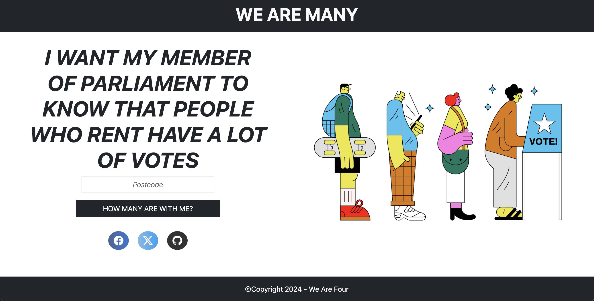

# We-Are-Many

## Project Goal

In the face of escalating tenancy rates and a growing housing crisis, our team has developed an innovative app aimed at empowering constituents to advocate for their housing needs effectively. With the ever-increasing challenge of securing affordable and suitable accommodation, our app provides users with a tool to look up census data to see the number of people in their constituency who share or don't share the same housing tenure. The app not only serves as a valuable resource for tenants to understand the occupancy landscape of their constituency but also equips them with the means to easily send this data to their their local Member of Parliament (MPs).

## Technologies used

### 3 server-side apis:
* Find that Postcode API: which enabled us to obtain the constituency ID for the searched postcode.
* Members API: Enabled us to obtain the details and contact information of the Member of Parliament utilising the constituency ID of the searched postcode.
* ONS API: Utilised the constituency ID obtained from the Find that Postcode API to obtain census data of total renters in a given constituency and the population of that constituency to determine the percentage of constituents who are renters.

### Client-side Storage:
We incorporated client-side storage in our app to enable the user to view their last search. We included the constituency area name along with the census data to remind the user of the location of his last search.

## Project Learnings
Building this rental housing advocacy app was an opportunity to further hone and develop our proficiency in API integration, JavaScript, HTML, CSS and incorporating Bootstrap to create a polished and responsive user interface. Utilising APIS with limited and challenging documentation was a significant initial hurdle to overcome that further developed our research and problem-solving skills. 

This project was an informative introduction to collaborative software development using the GitHub workflow. A critical aspect we grappled with was comprehending and resolving conflicts, recognising the importance of clear communication when multiple team members were concurrently contributing to the codebase. Addressing conflicts became an opportunity for growth, nurturing a culture of open dialogue and collective problem-solving. Additionally, the integration of GitHub's issue-tracking system proved pivotal in organising and prioritising tasks, ensuring each team member had a clear roadmap for their contributions. GitHub Projects also proved invaluable, enhancing our project management efficiency. The visual boards allowed seamless tracking of tasks and issues that were outstanding. 

## Application Link
https://cestsamual.github.io/We-Are-Many/ 

## Usage

To utilise the application, enter a postcode and click the "How Many Are With Me" button. If you wish to communicate with your Member of Parliament after searching your postcode, select the "Let Your MP Know" link. This action will open your default email application, automatically populating the email with the contact details of your constituency's MP.

### Welcome Homepage

### Application webpage after postcode search

## [License](LICENSE)
